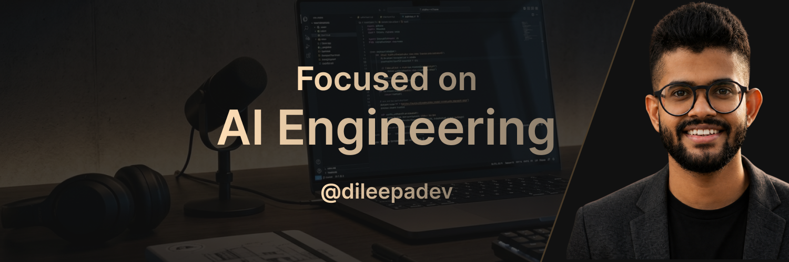

# Hi there 👋

I'm an **AI Engineer** from Sri Lanka, passionate about building intelligent applications powered by modern AI.

I enjoy turning ideas into practical AI solutions, including LLM-powered assistants, AI agents, scalable backend systems, and cloud-native applications. I also love sharing what I learn with the developer community through open source, workshops, and technical content.

## 🚀 What you'll find here

* 🤖 AI Agents & Agentic AI
* 🧠 Large Language Model (LLM) Applications
* ⚡ MCP (Model Context Protocol) & AI Integrations
* ☁️ Cloud & Backend Engineering
* 🛠️ Open source projects, experiments, and demos
* 📚 Learning resources and developer tools

## 🌱 Currently exploring

* Multi-agent systems
* Production-ready AI architectures
* AI engineering best practices
* Modern developer workflows for GenAI

## 🤝 Let's connect

If you're passionate about AI, open source, or building the next generation of intelligent applications, feel free to connect, collaborate, or contribute.

Thanks for stopping by! ⭐
